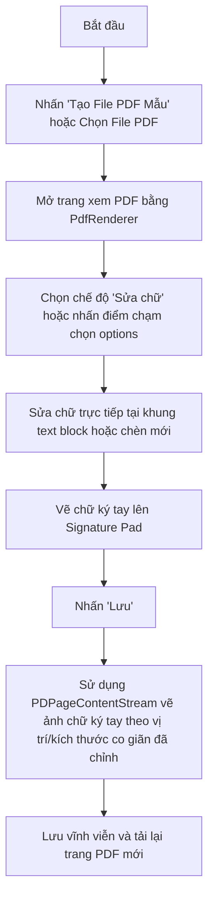
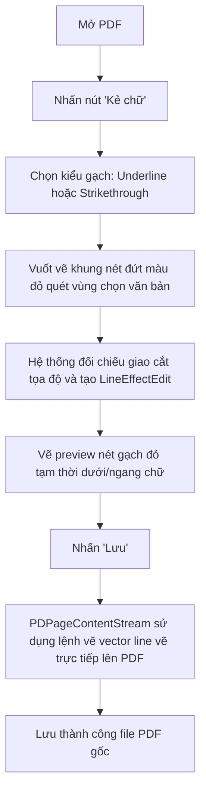

# Android Code Index - PDF E-Sign Demo

Dự án này là một ứng dụng Android Native (Kotlin) demo khả năng hiển thị và biên tập tài liệu PDF nâng cao. Hỗ trợ tạo mới tài liệu PDF mẫu, ký tên tay (có thể kéo thả, co giãn kích thước chữ ký sau khi vẽ), chỉnh sửa chèn/sửa chữ trực tiếp trên văn bản (inline editing), tô sáng (Highlight) và kẻ chữ gạch chân (Underline) hoặc gạch ngang (Strikethrough) văn bản thông qua quét vùng ngón tay. Ứng dụng sử dụng mã nguồn thư viện **PDFBox-Android** được tích hợp cục bộ dưới dạng module `:mylibrary` (gói `com.vandatgsts.mylibrary`) làm nòng cốt xử lý PDF.

---

## 🛠️ Công nghệ sử dụng
- **Ngôn ngữ:** Kotlin
- **Thư viện PDF:** PDFBox-Android clone tích hợp cục bộ (`:mylibrary`)
- **Kiến trúc:** Model-View-Controller (MVC) tối giản

---

## 📁 Cấu trúc thư mục chính

- [MainActivity.kt](file:///E:/Code/Vandatgsts/demopdf/app/src/main/java/com/vandatgsts/demopdf/MainActivity.kt): Chuyển tiếp chọn file PDF hoặc tự tạo PDF hợp đồng mẫu.
- [PdfViewerActivity.kt](file:///E:/Code/Vandatgsts/demopdf/pdfeditor/src/main/java/com/vandatgsts/pdfeditor/PdfViewerActivity.kt): Màn hình xem và chỉnh sửa PDF chính. Quản lý trạng thái và vẽ các đối tượng chỉnh sửa như text chèn, highlight, chữ ký (có kéo thả, co giãn bằng góc resize handle), gạch chân/gạch ngang, và thay thế/chèn ảnh.
- [SignatureView.kt](file:///E:/Code/Vandatgsts/demopdf/pdfeditor/src/main/java/com/vandatgsts/pdfeditor/SignatureView.kt): Custom View cho phép người dùng vẽ chữ ký tay tự do trên màn hình cảm ứng, xuất ra bitmap để đưa vào tài liệu.
- [activity_pdf_viewer.xml](file:///E:/Code/Vandatgsts/demopdf/pdfeditor/src/main/res/layout/activity_pdf_viewer.xml): Layout màn hình Viewer chứa thanh công cụ chỉnh sửa gộp vào 1 Menu (`btnMenuTools`) và vùng hiển thị trang PDF.
- [AndroidManifest.xml](file:///E:/Code/Vandatgsts/demopdf/app/src/main/AndroidManifest.xml): Cấu hình quyền và thiết lập FileProvider để chia sẻ file PDF cho các ứng dụng xem PDF ngoài một cách an toàn.

---

## 🚀 Luồng Nghiệp Vụ Chính (Flow)

### 1. Luồng E-Sign & Sửa chữ

### 2. Luồng Quét Vùng Kẻ Chữ

---

## 💡 Điểm nổi bật kỹ thuật
1. **Quét vùng chọn văn bản thông minh (Region Selection)**: Áp dụng công thức kiểm tra giao cắt không gian giữa vùng quét RectF tự do với tọa độ bounding box của các dòng chữ được trích xuất bằng `PDFTextStripper`.
2. **Hỗ trợ Tiếng Việt có dấu:** Đọc trực tiếp font `/system/fonts/Roboto-Regular.ttf` mặc định trên Android để làm BaseFont Unicode, giúp hiển thị tiếng Việt chính xác và đẹp mà không cần đính kèm file font dung lượng lớn vào app.
3. **Ký số bằng hình ảnh trong suốt:** Xuất bitmap vẽ từ Canvas có nền trong suốt (`Color.TRANSPARENT`) dưới định dạng PNG, đảm bảo chữ ký chồng lên tài liệu tự nhiên.
4. **Mở file an toàn:** Sử dụng `androidx.core.content.FileProvider` đáp ứng hoàn toàn cơ chế bảo mật của Android 7.0+ để mở tệp PDF bên ngoài.
